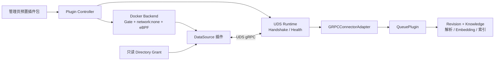

# 外部 DataSource 插件开发与部署

WeKnora V1 允许第三方用 Go 编写 **DataSource** 插件。插件在 WeKnora 管理的
本机 Docker 容器中运行，经 UDS gRPC 只输出资源和原始文件；WeKnora 负责
Revision 幂等、解析、分块、Embedding、索引和 Knowledge 生命周期。现阶段不开放
Parser、WebSearch、ModelProvider 或 RetrievalEngine 的外部协议，这四类与
DataSource 等五类内置能力仍由同一个 PluginManager 管理。



Host 不接受插件指定镜像、宿主路径、Docker 参数或网络权限。Plugin Controller
完成 Handshake、配置校验和 Health 后才发布业务 Handle；Disable、Grant 撤销或
健康失败会先阻止新调用，再回收实例。

## 15 分钟快速开始

当前仓库在 `examples/plugins/datasource-go` 提供最小模板。SDK 尚未独立发布，
合并前使用模板脚本创建临时 `go.work`；模板的 `go.mod` 不包含个人目录或永久
`replace`。

```bash
cp -R /path/to/WeKnora/examples/plugins/datasource-go ./my-datasource
cd my-datasource
./scripts/with-sdk.sh /path/to/WeKnora go test ./...
./scripts/with-sdk.sh /path/to/WeKnora go vet ./...
./scripts/build.sh /path/to/WeKnora "$PWD/dist/example.hello"
```

修改 `plugin.yaml` 与 `main.go` 中的 ID、版本、extension 和 capabilities，再替换
`source.go` 的固定文档来源。测试会启动真实 UDS Server，通过公开
`pkg/plugin/sdk/contracttest` 完成 Handshake、ValidateConfig、Health、资源枚举和
两次增量 Sync，不需要网络或外部凭据。

构建包结构固定为：

```text
example.hello/
├── plugin.yaml
└── bin/
    └── plugin-linux-amd64
```

将该目录放入管理员配置的 `external_plugins.packages.app_root`，确保其 Host Path
映射也指向相同宿主内容，然后重启 WeKnora。启动时扫描包目录；V1 不支持在线
上传、文件监听或热更新。

使用已登录用户的 JWT 调用 API。下面的系统管理员同时具备工作区 Admin 权限，
`INSTALLATION_ID` 来自插件列表，`KNOWLEDGE_BASE_ID` 来自已有知识库：

```bash
API=http://127.0.0.1:8080/api/v1
AUTH='Authorization: Bearer <system-admin-jwt>'

curl -fsS -H "$AUTH" "$API/plugins"
curl -fsS -H "$AUTH" -H 'Content-Type: application/json' \
  -d '{"knowledge_base_id":"<KNOWLEDGE_BASE_ID>","installation_id":"<INSTALLATION_ID>","name":"Hello source","settings":{},"resource_ids":["grant_root"],"sync_schedule":""}' \
  "$API/plugins/datasources"

curl -fsS -H "$AUTH" -H 'Content-Type: application/json' \
  -d '{"allow_root_id":"documents","relative_directory":"team-a"}' \
  "$API/plugins/datasources/<DATA_SOURCE_ID>/grants"

curl -fsS -H "$AUTH" -X POST \
  "$API/plugins/datasources/<DATA_SOURCE_ID>/lifecycle/enable"
curl -fsS -H "$AUTH" -X POST -H 'Content-Type: application/json' -d '{}' \
  "$API/datasource/<DATA_SOURCE_ID>/sync"
curl -fsS -H "$AUTH" "$API/plugins/datasources/<DATA_SOURCE_ID>"
curl -fsS -H "$AUTH" \
  "$API/plugins/datasources/<DATA_SOURCE_ID>/audit?action=plugin.network_denied&limit=50"
```

创建操作先得到 paused DataSource 和 Binding；没有有效 Grant 时不能 Enable。
Host 路径授权和内置能力启停仅限系统管理员，租户成员只能按现有 RBAC 操作其
有权访问的知识库和数据源。API 从认证上下文取得租户身份，不接受请求伪造
tenant ID，也不会向普通用户返回授权目录的 Host Path。

## Manifest 最小参考

模板中的完整最小 Manifest 如下。定义以
[`internal/plugin/control/manifest.go`](https://github.com/Tencent/WeKnora/blob/main/internal/plugin/control/manifest.go) 的
严格校验为准。

```yaml
apiVersion: plugins.weknora.io/v1alpha1
kind: Plugin
metadata:
  id: example.hello
  name: Hello DataSource
  version: 0.1.0
spec:
  protocolVersion: "1.0"
  compatibility:
    weknora: ">=0.8.0 <0.9.0"
  extension:
    id: hello
    type: datasource
    contractVersion: "1.0"
    capabilities: [resource_listing, full_sync, incremental_sync]
  runtime:
    kind: sandbox_service
    transport: uds
    entrypoint: bin/plugin-linux-amd64
  permissions:
    network: none
    filesystem: selected_directory_readonly
  resources:
    memoryMiB: 256
    cpuQuota: 0.5
    maxProcesses: 32
  configSchema:
    type: object
    additionalProperties: false
```

`metadata.id` 必须是 `publisher.name`，版本必须是合法 semver。V1 只接受
`datasource`、`sandbox_service`、`uds`、`network:none` 和只读目录授权。
capability 仅支持 `resource_listing`、`full_sync`、`incremental_sync`、
`deletion_events`。内存范围为 64–4096 MiB，CPU 为 0.1–4 核，PID 为 1–256，
并且不能超过管理员上限。

入口是规范的包内相对路径；绝对路径、`..`、符号链接和特殊文件均被拒绝。
Manifest 拒绝未知 YAML 字段，JSON Schema 必须是禁止未知属性的 object，且
`$ref` 只能指向本地 Schema。一个包最多 1024 个文件、128 MiB，Manifest 最多
256 KiB；同 ID/version 的内容变化会改变 digest，不能静默替换活动安装。

## DataSource 契约

协议定义在 [`api/proto/plugin/v1/plugin.proto`](https://github.com/Tencent/WeKnora/blob/main/api/proto/plugin/v1/plugin.proto)，
Go SDK 在 [`pkg/plugin/sdk`](https://github.com/Tencent/WeKnora/tree/main/pkg/plugin/sdk)。协议版本和 DataSource Contract
版本分别演进：同 Major、实现 Minor 不低于请求 Minor时兼容；破坏性变化提升
Major。

| RPC / 事件 | 插件职责 |
| --- | --- |
| `Handshake` | 回显 Host 指定的身份与一次性 nonce，声明实际 capability |
| `ValidateConfig` | 严格校验当前实例配置，不建立全局状态 |
| `Health` | 轻量检查是否可服务，不扫描全部数据 |
| `Shutdown` | 在 deadline 内结束；Server 关闭由 SDK 协助 |
| `ListResources` | 返回可选择资源；只读目录插件至少返回 `grant_root` |
| `ResolveAncestors` | 按现有资源选择语义返回祖先；未知 ID 明确报错 |
| `Sync` | 使用旧 Cursor 判断新增、修改和删除，流式返回事件 |
| `DocumentUpsert` | 原始 bytes、稳定 external_id 和确定性 revision |
| `DocumentDelete` | 完整成功枚举后确认的删除，重复发送必须安全 |
| `ItemError` | 单项失败；本轮随后不得产生成功 Checkpoint |
| `Checkpoint` | 本轮所有先前事件发送成功后的最终 opaque Cursor |

`external_id` 在一个 DataSource 内稳定唯一。`revision` 标识该路径的一次内容
版本：同一旧 Cursor 重试必须稳定，A→B→A 或删除后重建不能碰撞历史版本。
Cursor 是插件私有、带版本的有限 JSON；Host 只保存和原样回传。插件用它判断
新增、修改和删除，不能依赖进程内存、`/tmp` 或自己的数据库。

插件逐项发送原始文件 bytes，保留文件名和内容类型，不在插件内解析、切块、
Embedding 或索引。文档最大 32 MiB、配置最大 256 KiB、Cursor 最大 1 MiB、gRPC
消息最大 33 MiB。V1 不支持分片，也不兑现 `replaces_subtree` / `subtree_keep`；
设置非默认值会被 Host 在持久接受前拒绝。

只有完整成功枚举后才能判断删除并发送最终 Checkpoint。发送失败、ItemError、
取消或流错误必须立即返回；不能发送跨过失败位置的新 Checkpoint。Checkpoint
发出不等于 Host 已提交，插件收到旧 Cursor 时仍须可重放。Host 负责重复
revision 幂等、pending 任务恢复以及新 Knowledge 成功后替换旧版本。

## 管理员部署边界

外部插件默认关闭。关闭时 WeKnora 不要求 Docker/BPF 权限；显式启用但缺少
必需能力时启动 fail closed。下面是宿主运行时的配置形状，所有路径和镜像均由
管理员维护：

```yaml
external_plugins:
  enabled: true
  deployment_id: weknora-plugin-controller-1
  backend_replicas: 1
  docker_host: unix:///var/run/docker.sock
  image: weknora-plugin-runtime:local
  gate_app_path: /srv/weknora/plugin/gate
  gate_host_path: /srv/weknora/plugin/gate
  packages: {app_root: /srv/weknora/plugins, host_root: /srv/weknora/plugins}
  artifact_root: {app_root: /srv/weknora/artifacts, host_root: /srv/weknora/artifacts}
  runtime_root: {app_root: /srv/weknora/runtime, host_root: /srv/weknora/runtime}
  allow_roots:
    documents: {app_root: /srv/documents, host_root: /srv/documents}
  admin_uid: 1000
  plugin_uid: 65532
  plugin_gid: 65532
  max_instances: 8
  max_resources: {memoryMiB: 256, cpuQuota: 0.5, maxProcesses: 32}
```

`app_root` 是 Controller 自己访问的路径，`host_root` 是传给本机 Docker daemon
的宿主路径；在宿主直接运行时两者相同，在受控应用容器中必须显式映射到同一
内容，系统不会猜路径。packages、artifact、runtime、allow-root 和固定镜像须由
管理员预置；镜像不得由插件选择。`deployment_id` 与 runtime root 跨重启稳定，
才能识别并回收本部署遗留实例。

Controller 需要本机 Unix Docker socket、cgroup v2、bpffs、内核 BTF，以及
`CAP_BPF`、`CAP_NET_ADMIN`、`CAP_PERFMON`；当前有界 UDS tmpfs 还需要
`CAP_SYS_ADMIN`。受控应用容器测试额外使用 `CAP_DAC_OVERRIDE` 穿越受信任的
宿主映射。插件容器本身始终非 root、`CapDrop=ALL`、只读 RootFS、
`no-new-privileges`、`network:none`，不会获得 Docker socket、cgroup、bpffs、
宿主根目录或 WeKnora 凭据。

Directory Grant 将管理员批准的一个 allow-root 子目录只读挂载为
`/data/source`。授权会校验租户/DataSource 归属、撤销状态、路径每层 symlink、
device/inode 和启动前身份。V1 不允许在同一 DataSource 原地更换 extension、
Grant 根或资源范围；应停用旧源并新建 DataSource，避免旧 Cursor 解释新目录。

Docker `network:none` 移除网络接口；cgroup connect/sendmsg eBPF 同时拒绝并从
可信 Host 路径记录尝试。策略、审计 sink 或溢出检测不可用时实例被停止，不能
降级为只打印插件日志。单节点只允许运行一个 Controller，镜像必须预加载。

当前真实验收覆盖“受控 WeKnora 应用容器连接本机 Docker daemon”模式。配置也
支持 `app_root == host_root` 的 Linux 宿主进程形态，但本轮没有把它表述为已完成
同等真实验收。Windows、macOS、远程 Docker、远程插件服务、多 Controller、
出站 allowlist 和热升级均不支持。

## 状态、停用与排查

外部实例以 Binding 的 `observed_state` 和 `last_error` 为准：`STARTING`、
`READY`、`DEGRADED`、`NOT_READY`、`STOPPED`、`FAILED`。发现包不会自动启用；
Manifest/Artifact 无效会留在 Installation 状态并提供可定位错误。Enabled Binding
在应用重启时经扫描、停止遗留实例、重新 Handshake 后恢复，opaque Cursor 和
pending Revision 仍由 Host 持久层恢复。

常见失败按顺序检查：

- Installation 为 invalid：检查 ID/semver、未知字段、兼容范围、入口与包 digest；
- Binding 为 NOT_READY：确认 Grant 已创建且归属正确、固定同步范围未被更换；
- 环境预检失败：确认本机 Docker、cgroup v2、bpffs、BTF、能力和可信审计存储；
- UDS 不健康：确认 app/host runtime 映射一致、路径长度和非 root UID/GID；
- 同步失败：读取 sync log；ItemError 或持久化失败不会推进 Cursor；
- 审计缺口：实例会 fail closed，系统管理员查看 Binding LastError 和审计记录。

停用使用 lifecycle API，它先持久化期望状态，再阻断新调用并停止实例；应用正常
退出不会把 enabled 改成 disabled。Grant 撤销不可逆地停止该旧同步范围。生产
API 实现在 [`internal/router/routes_plugin.go`](https://github.com/Tencent/WeKnora/blob/main/internal/router/routes_plugin.go)，
正式 Backend 在 [`internal/plugin/sandbox/docker`](https://github.com/Tencent/WeKnora/tree/main/internal/plugin/sandbox/docker)。
